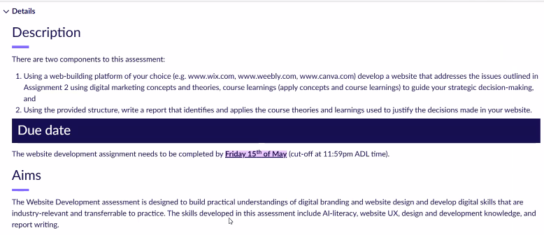
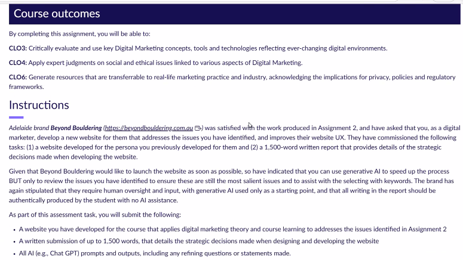
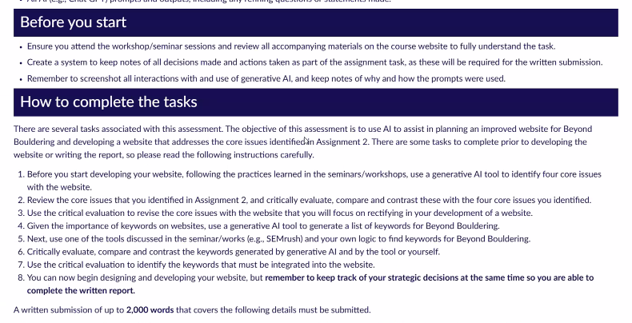
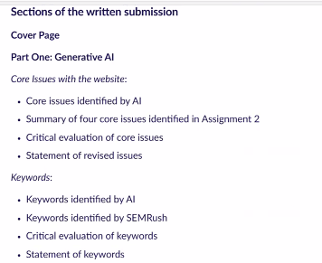
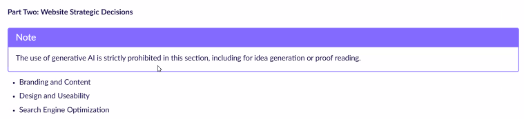
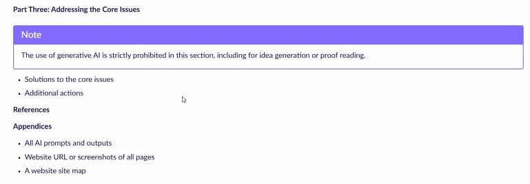

# Beyond Bouldering Website Redesign Report

## Introduction

This report documents the redesign of the Beyond Bouldering Adelaide website prototype. The project was developed as a Vite, React, and TypeScript front-end application, with the main implementation located in `web/src/App.tsx` and the visual system defined in `web/src/index.css`. The purpose of the redesign was not to reproduce the original website as a visual copy. Instead, the project reframed the homepage as a decision-support interface for first-time visitors who need to understand indoor bouldering, compare prices, choose a location, and complete the pre-visit waiver with minimal uncertainty.

The design problem is best understood as a conversion and information-architecture problem. A climbing gym website must communicate atmosphere and brand personality, but it also needs to reduce the cognitive cost of planning a first visit. For a new user, the homepage is not simply an advertising surface. It is the point at which the user asks practical questions: Is bouldering suitable for beginners? Do I need equipment? What is the safest and cheapest first option? Which Adelaide location fits my routine? Do I need to complete paperwork before arriving? The redesigned homepage addresses these questions in a single guided journey.



## User Problem and Strategic Framing

The primary user considered in this redesign is a first-time indoor bouldering visitor in Adelaide. The prototype uses Haoyuan Ma as a representative user: digitally confident, likely to compare options before visiting, but not yet familiar with climbing terminology, gym etiquette, waiver requirements, or pricing logic. This type of user is not necessarily resistant to trying bouldering. The larger barrier is uncertainty. When the user cannot quickly determine what to do next, the website increases friction at precisely the moment when confidence should be built.

This insight is consistent with cognitive load theory. Sweller (1988) argues that problem solving becomes less effective when working memory is consumed by unnecessary processing demands. In a website context, this means that scattered prices, unclear first-visit instructions, hidden waiver steps, or ambiguous location information create extraneous cognitive load. The user may still find the information eventually, but the experience requires avoidable effort. The redesign therefore treats clarity as a functional requirement, not merely a writing preference.

The project also draws on the technology acceptance model. Davis (1989) identifies perceived usefulness and perceived ease of use as major determinants of whether users accept a system. For this website, usefulness is expressed through task-relevant content: pricing comparison, beginner guidance, location selection, and waiver preparation. Ease of use is expressed through a linear page structure, visible calls to action, readable sections, and responsive layouts that continue to function under browser zoom and narrow viewport conditions.

From a customer-experience perspective, the website is only one touchpoint in a larger service journey. Lemon and Verhoef (2016) emphasize that customer experience develops across multiple stages and touchpoints rather than within a single interaction. For Beyond Bouldering, the homepage should therefore connect the digital pre-visit stage with the physical gym visit. The redesign uses the homepage to prepare the user before arrival, making the later in-person experience more predictable and less intimidating.

## Evaluation of the Existing Experience

The original experience appears to have a strong brand identity and an energetic visual style, which are appropriate for an indoor bouldering brand. However, from a first-time conversion perspective, the experience can be improved by strengthening task sequencing and reducing informational fragmentation. A visually striking homepage can generate interest, but if the user still has to search for first-visit requirements, price differences, location suitability, and waiver expectations, the interface has not fully supported the conversion task.

The first issue is that the beginner journey needs to be more explicit. A user who has never been to a bouldering gym may not know whether ropes are required, whether staff will explain safety rules, whether shoes are available for hire, or whether they should arrive early. If this information appears late or is distributed across separate pages, the user must construct the journey independently. The redesign makes "First Time" a primary navigation item and a homepage section, turning the implicit path into an explicit sequence.

The second issue is pricing comparison. Price is not only a financial detail; it communicates commitment level. A single-entry pass, beginner starter pack, multi-visit pass, and membership each imply a different relationship with the service. For a new user, the meaningful question is not "Which price is cheapest?" but "Which option is appropriate for my current level of commitment?" The redesigned pricing section therefore presents each plan with a label, use case, price, explanation, and action button. This format supports faster comparison and reduces the need to infer value from price alone.

The third issue is the waiver step. Waivers are common in physical activity services, but they are also a potential point of friction. If the user discovers the waiver requirement too late, the service journey begins with administrative interruption. In the redesign, the waiver is treated as a visible part of the conversion funnel. It appears in the hero calls to action and in a dedicated final section, which positions it as a normal pre-arrival step rather than an unexpected obligation.

The fourth issue is local relevance. Users searching for an Adelaide climbing gym often search by area, routine, or travel convenience. A location list is helpful, but a location comparison is more useful. The redesign connects Kent Town, Keswick, and Thebarton with routine-based explanations, facilities, and access notes. This aligns the digital experience with the user's real-world decision process.



## Information Architecture and Page Narrative

The redesigned homepage follows a sequence from orientation to decision to action. The hero section introduces the central value proposition: "Start climbing in Adelaide without the guesswork." This line was chosen because it addresses the user's uncertainty directly. It does not merely say that the gym exists; it tells the user that the page will remove ambiguity from the first visit. The three hero actions - First time guide, Compare prices, and Complete waiver - correspond to the main tasks a new visitor is likely to perform.

The proof strip immediately below the hero compresses key facts into a quick confirmation layer: three Adelaide locations, a suggested first-visit buffer, one pricing comparison view, and beginner safety guidance. This section is intentionally brief. Its role is to provide reassurance and signal that the page is practical, not to overload the user with detail.

The First Time section then converts reassurance into instruction. It breaks the first visit into three steps: choose a simple pass, complete the waiver, and arrive prepared. This structure follows a procedural model, which is useful because first-time users are often seeking a script for what will happen. The supporting safety panel explains that bouldering does not require ropes, that padded floors are used, that staff explain basic rules, and that rental shoes and chalk are available. These points reduce anxiety and correct possible misconceptions.

The Pricing section is placed early because price comparison is a major decision point. The card layout supports direct comparison and makes the beginner option visually prominent. The Beginner Starter Pack is featured because it reduces equipment uncertainty and gives the user enough time to evaluate whether ongoing membership makes sense. This is a strategic recommendation rather than a neutral price table: the page guides the user toward the option most consistent with a first-time trial.

The Locations section uses a tab interaction to compare Kent Town, Keswick, and Thebarton. The tabs preserve page compactness while allowing users to shift between locations without scrolling through repeated blocks. Each tab emphasizes fit, access, and facilities rather than only naming the branch. This is important because a service location becomes meaningful when it is mapped to a user's routine.

Later sections address retention and search discovery. Classes and community content shows that the first visit can lead to beginner classes, coaching, events, and progression. This supports the broader customer journey because the goal is not only to produce one visit but also to make the first experience feel like the beginning of a sustainable activity. The SEO section makes the local search strategy visible through long-tail keywords. Finally, the waiver form closes the page with a concrete action.



## Visual Design and Interaction Rationale

The visual direction balances energy with task clarity. Cobalt blue, lime, and rose create a high-contrast identity that suits an active recreation brand, while white cards, restrained borders, and consistent spacing preserve readability. The redesign avoids a purely decorative landing-page structure. Instead, images and color support the task hierarchy: hero image for atmosphere, cards for comparison, tabs for selection, and a form for final action.

The use of real climbing imagery is important for credibility. Fogg et al. (2003) found that design look, information structure, and information focus influence how users evaluate the credibility of websites. For a venue-based service, visual credibility depends partly on showing the actual type of environment users will enter. The chosen imagery communicates walls, training, coaching, and events. These visuals help the user imagine the visit before committing to it.

The later iteration strengthened this visual strategy by ensuring that every media-supported heading has a real corresponding image. The pricing, location, and local-search sections now each pair their strategic message with an authentic gym image, so no section depends on an empty image slot or placeholder. This is particularly important in the SEO section, where the heading "Local search terms are built into the page" is now supported by a coaching image that connects search discovery with actual class and service content.

The interface also reflects established usability heuristics. Nielsen (1994) argues that heuristic principles help explain usability problems and guide interface evaluation. In this redesign, visibility of system purpose is achieved through section headings and direct calls to action; match with user needs is achieved through beginner-focused language; consistency is achieved through repeated card and button patterns; and error prevention is addressed by making the waiver requirement visible before arrival.

The calls to action were treated as high-priority interaction targets. Fitts's law states that target acquisition depends on target size and distance (Fitts, 1954). While this project does not mathematically model pointer movement, the design applies the principle by using large, high-contrast buttons with stable spacing and clear labels. The minimum button height of 44px supports reliable selection on touch and pointer devices.

The page also considers retrospective experience. The Classes and Community section is informed by the peak-end rule literature, which shows that people often evaluate experiences disproportionately through intense moments and endings (Kahneman et al., 1993). For a climbing gym, events, coaching, and structured challenges can become memorable peaks, while a smooth waiver and clear arrival process can improve the end of the pre-visit digital journey. The website therefore supports both immediate conversion and later remembered satisfaction.

To make the interface feel more polished and responsive, the final prototype also adds restrained motion design. Section headings, content sections, and image blocks use an IntersectionObserver-based rise-and-fade reveal, so text and imagery enter the page only when they become visible rather than remaining tied to an unstable scroll-progress opacity. Cards, buttons, images, and active location tabs also have hover or selected-state feedback. These effects are intentionally subtle: they add perceived responsiveness and visual interest without changing the page structure or distracting from the conversion path. A `prefers-reduced-motion` media query disables meaningful movement for users who prefer reduced animation.



## Technical Implementation

The project is implemented as a React single-page prototype. `App.tsx` defines the content structure, arrays for pricing plans, locations, first-time steps, safety items, events, and SEO keywords. These arrays are rendered through mapped components, which keeps the page maintainable and reduces repeated markup. For example, the pricing cards are generated from a `pricePlans` array, allowing future updates to plan names, prices, and descriptions without restructuring the JSX.

The location comparison uses React state. The `activeLocation` state stores the currently selected location key, and the location card updates based on user selection. This is a lightweight interaction, but it demonstrates a practical pattern for service comparison. It also keeps the page focused: instead of expanding three full location blocks at once, the user sees one detailed comparison state at a time.

The main stylesheet uses CSS Grid and Flexbox extensively. Grid is used for the hero layout, proof strip, journey cards, pricing cards, location layout, event cards, and waiver section. Flexbox is used for navigation and tag-like lists where wrapping is appropriate. This combination allows the page to move from multi-column desktop layouts to single-column mobile layouts without requiring JavaScript-driven layout changes.

The implementation includes a reusable `OptimizedImage` component for page imagery. It keeps the original image files and quality intact, adds explicit dimensions to reduce layout shift, uses native `loading` and `decoding` attributes, and retries the same image path if a deployment path issue prevents a first load. The browser console message about lazy-loaded images being deferred is an intervention notice rather than a functional error; the lower-page images are intentionally lazy-loaded to reduce initial memory and network pressure.

The final layout pass also corrected a desktop hero overflow issue. The hero headline now uses a more conservative desktop-only type scale because it sits inside a narrow copy column beside the main image at 100% browser zoom. Once the layout switches to a single column below the desktop breakpoint, the heading can safely return to a larger responsive scale without causing horizontal overflow.

The HTML entry file includes SEO metadata, Open Graph information, and JSON-LD structured data. This supports digital discoverability and communicates the site's topic to search engines. Kannan and Li (2017) describe digital marketing as a system of touchpoints shaped by digital technologies; in that sense, the metadata is not a separate technical afterthought but part of the broader acquisition strategy.



## Responsive and Browser-Zoom Assessment

A specific requirement of the review was to determine whether browser zoom could cause layout buttons to stack incorrectly or overlap. The static CSS inspection identified that most button groups were structurally safe. The top navigation uses a flex layout, and the `.nav` element allows horizontal overflow. Navigation links use `white-space: nowrap`, which prevents labels from breaking into multiple lines. At widths below 820px, the brand text is hidden, the logo is reduced, and the Book now button is removed. These decisions reduce header pressure and prevent overlap.

The main risk was the hero action group. Originally, `.hero-actions` used a fixed three-column grid: `repeat(3, minmax(0, 1fr))`. This works on wide screens, but at browser zoom levels or viewport widths near the 1080px breakpoint, the right-hand hero text column can become narrow while the buttons still attempt to remain in three columns. The likely failure mode is not physical overlap, but compressed buttons, awkward text wrapping, and unstable visual hierarchy. Because the hero is the first conversion area, this risk was significant enough to fix.

The implemented solution replaces the fixed grid with an adaptive grid:

```css
.hero-actions {
  display: grid;
  grid-template-columns: repeat(auto-fit, minmax(min(100%, 180px), 1fr));
  gap: 0.75rem;
  margin-top: 1.6rem;
  max-width: 630px;
}
```

This rule allows the call-to-action buttons to remain in multiple columns when there is sufficient space, but automatically collapse to two columns or one column when the container becomes too narrow. It is more robust than relying only on media queries, because zoom level, font rendering, and viewport dimensions can change the actual available space in ways that do not always align with predefined breakpoints.

Other areas were assessed as lower risk. Location tabs are intentionally vertical and therefore are not a layout failure when they appear stacked. Footer navigation uses `flex-wrap`, so wrapping is expected. Pricing actions are contained within separate cards, and the price grid changes from four columns to two columns and then to one column at smaller breakpoints. The waiver section contains a single primary form action, so it does not introduce button-group collision.

## Testing and Validation

After the CSS adjustment, the project was validated through production build and development-server testing. The build command was run from the `web` directory:

```bash
npm run build
```

The build completed successfully. Vite generated the production files in `web/dist`, including `dist/index.html`, a CSS bundle, and a JavaScript bundle. This confirms that the React and TypeScript source compiled correctly and that the updated CSS did not introduce a build-time error.

The development server was then started with:

```bash
npm run dev -- --host 127.0.0.1
```

The local server responded successfully at `http://127.0.0.1:5173` with HTTP status `200`. A further check confirmed that the served `src/index.css` contained the updated `.hero-actions` adaptive grid rule. This matters because it verifies that the running development site is using the corrected style, not an older cached or built file.

It should be noted that the parent project folder is not a Git repository, so changes were made directly to the file system rather than committed through version control. The deliverable files are nevertheless present in the workspace: the React source, CSS, static images, build output, screenshots, and this report.



## SEO and Content Strategy

The SEO strategy focuses on local intent. A user looking for this service may not search directly for the brand. They may search for "bouldering for beginners in Adelaide," "indoor bouldering Adelaide CBD," "beginner climbing gym Kent Town," "climbing gym Keswick," or "bouldering classes Adelaide." The redesign integrates these phrases into visible page content and metadata while keeping them connected to meaningful user tasks.

This avoids keyword stuffing. The keywords appear in contexts where they help the user: beginner guidance, location comparison, class discovery, and social fitness positioning. This is consistent with a digital marketing view in which search, content, and service experience are interconnected rather than isolated channels (Kannan & Li, 2017). The page is designed to be findable, but also useful after it is found.

## Outcome and Professional Assessment

The final prototype improves the homepage by turning it into a guided first-visit experience. The redesign clarifies the beginner path, reduces pricing ambiguity, makes location choice more contextual, and connects online preparation to the physical gym visit. The visual system remains energetic, but the page no longer depends on visual impact alone. Its structure now supports decision-making.

The final media pass also corrected the remaining section-level image gap beside the local-search heading and added a more attractive interaction layer. The result is a page that feels less static while still preserving the original imagery, original image quality, and the task-focused information architecture.

Professionally, the strongest aspect of the redesign is the alignment between user uncertainty and content hierarchy. Each major section answers a specific user question. The main weakness is that the data remains conceptual. To move into production, current prices, exact addresses, operating hours, and the real waiver system would need to be integrated. Accessibility could also be strengthened by implementing fuller keyboard behavior for the tab interface and by adding real validation states to the waiver form.

Future testing should include Playwright screenshots at 390px, 768px, 1080px, and 1440px, plus browser zoom checks at 125% and 150%. Lighthouse testing should also be used to evaluate performance, accessibility, best practices, and SEO. Because the page uses several large images, responsive image optimization would be a practical next step before deployment.

## Conclusion

This redesign demonstrates how a venue website can move beyond brand presentation and become a functional conversion tool. By applying principles from cognitive load theory, technology acceptance, usability heuristics, credibility research, customer journey theory, and digital marketing, the prototype gives first-time users a clearer route from interest to action. The project has been implemented, built successfully, served locally, and adjusted to address a concrete responsive-layout risk in the hero call-to-action group.

The final deliverable includes the working React/Vite website, the updated CSS layout fix, build output, screenshot evidence, and this written report. The result is a more professional, task-oriented, and academically defensible redesign of the Beyond Bouldering Adelaide homepage.

## References

Davis, F. D. (1989). Perceived usefulness, perceived ease of use, and user acceptance of information technology. *MIS Quarterly, 13*(3), 319-340. https://doi.org/10.2307/249008

Fitts, P. M. (1954). The information capacity of the human motor system in controlling the amplitude of movement. *Journal of Experimental Psychology, 47*(6), 381-391. https://doi.org/10.1037/h0055392

Fogg, B. J., Soohoo, C., Danielson, D. R., Marable, L., Stanford, J., & Tauber, E. R. (2003). How do users evaluate the credibility of Web sites? A study with over 2,500 participants. In *Proceedings of the 2003 Conference on Designing for User Experiences* (pp. 1-15). Association for Computing Machinery. https://doi.org/10.1145/997078.997097

Kahneman, D., Fredrickson, B. L., Schreiber, C. A., & Redelmeier, D. A. (1993). When more pain is preferred to less: Adding a better end. *Psychological Science, 4*(6), 401-405. https://doi.org/10.1111/j.1467-9280.1993.tb00589.x

Kannan, P. K., & Li, H. A. (2017). Digital marketing: A framework, review and research agenda. *International Journal of Research in Marketing, 34*(1), 22-45. https://doi.org/10.1016/j.ijresmar.2016.11.006

Lemon, K. N., & Verhoef, P. C. (2016). Understanding customer experience throughout the customer journey. *Journal of Marketing, 80*(6), 69-96. https://doi.org/10.1509/jm.15.0420

Nielsen, J. (1994). Enhancing the explanatory power of usability heuristics. In *Proceedings of the SIGCHI Conference on Human Factors in Computing Systems* (pp. 152-158). Association for Computing Machinery. https://doi.org/10.1145/191666.191729

Sweller, J. (1988). Cognitive load during problem solving: Effects on learning. *Cognitive Science, 12*(2), 257-285. https://doi.org/10.1207/s15516709cog1202_4

## Appendix A: AI-Assisted Prototype Development Log

This appendix records how AI support was used for prototype development, technical review, and implementation planning. The entries below are written in English and reconstructed from the development tasks carried out during the project. They are not presented as verbatim transcripts from a specific external design platform. Instead, they document the type of prompts, reasoning goals, AI response patterns, and human decisions that informed the website prototype. The final design decisions, code acceptance, content selection, and testing interpretation remained the responsibility of the student.

### Prompt A1: First-Time Visitor Journey and Information Architecture

**Development prompt:** "Act as a senior UX strategist reviewing the homepage of an indoor bouldering gym in Adelaide. The primary user is a first-time visitor who is interested in bouldering but uncertain about safety, equipment, pricing, locations, and waiver requirements. Propose an information architecture for a redesigned homepage that reduces cognitive load, supports comparison between price options, and guides the user from initial interest to a concrete pre-visit action. Explain the rationale using customer journey thinking and beginner-user anxiety reduction."

**AI response summary:** The AI recommended structuring the homepage as a guided first-visit journey rather than a purely promotional landing page. It proposed a sequence beginning with a direct value proposition, followed by beginner reassurance, a step-by-step first-time guide, a pricing comparison section, location comparison, community or class content, SEO-focused discovery language, and a final waiver action. The response emphasized that new users need a procedural script for what to do before arriving, because uncertainty about safety and preparation can become a conversion barrier.

**Human decision and application:** This output informed the page order used in the prototype: Hero, Proof Strip, First Time, Pricing, Value Proposition, Locations, Classes and Community, SEO, Waiver, and Footer. The recommendation was accepted because it matched the assignment goal of improving first-time conversion and created a clearer relationship between digital browsing and the physical gym visit.

### Prompt A2: Conversion-Oriented Hero and CTA Hierarchy

**Development prompt:** "Design a hero section strategy for a bouldering gym homepage where the user has low prior knowledge of climbing. The hero should communicate the brand energy but must also reduce ambiguity. Recommend a headline, supporting message, and three calls to action. The CTA hierarchy should distinguish between learning, comparing, and acting, and should avoid generic marketing language."

**AI response summary:** The AI suggested that the hero should directly address uncertainty rather than relying on a vague lifestyle slogan. It recommended a headline centered on starting climbing in Adelaide without guesswork, with CTAs mapped to the user’s likely intent: learn what happens on the first visit, compare prices, and complete the waiver. The response also noted that equal-weight CTAs can create decision fatigue, so the visual design should make the beginner guide and price comparison especially visible.

**Human decision and application:** The final prototype uses the headline "Start climbing in Adelaide without the guesswork" and three Hero CTAs: "First time guide," "Compare prices," and "Complete waiver." This structure was chosen because it turns the first screen into a task router for new users instead of a purely aesthetic introduction.

### Prompt A3: Pricing Comparison and Decision Support

**Development prompt:** "Review the pricing section for a climbing gym website. The user is comparing a beginner starter pack, casual entry, a ten-visit pass, and membership. Recommend a card structure that helps users understand not only the cost but also the appropriate use case for each option. Apply decision-support principles and avoid making the user infer value from price alone."

**AI response summary:** The AI recommended that each price card include a short category label, plan name, price, plain-language explanation, a 'best for' statement, and a clear action link. It argued that pricing is not just a numerical comparison but a commitment-level comparison. The beginner starter pack should be highlighted because it reduces uncertainty around equipment and gives the user time to evaluate the activity before committing to membership.

**Human decision and application:** The final `pricePlans` data structure in `App.tsx` follows this model. Each plan includes `label`, `name`, `price`, `detail`, `bestFor`, and `action`. The Beginner Starter Pack is visually featured because it is the most appropriate entry point for the first-time persona.

### Prompt A4: Location Comparison as Routine-Based Selection

**Development prompt:** "Create a UX model for comparing three local gym locations: Kent Town, Keswick, and Thebarton. Instead of listing addresses only, explain how each location should be framed around user routines, travel context, and facilities. Recommend a compact interaction pattern suitable for a single-page React prototype."

**AI response summary:** The AI recommended a tab-based location comparison. It suggested that each location should include an area descriptor, a 'best fit' statement, a travel or access note, and a short list of facilities. The response argued that location choice is not only geographic; it is connected to commuting patterns, work or study routines, and intended use. A tab interaction was recommended because it allows comparison without creating a long repetitive page.

**Human decision and application:** The prototype implements this with a `LocationKey` state and a `locations` object. The user can switch between Kent Town, Keswick, and Thebarton, and the content updates dynamically. This kept the homepage compact while still making location choice more meaningful.

### Prompt A5: Responsive Layout and Browser-Zoom Risk Review

**Development prompt:** "Perform a static CSS review for a React homepage and identify whether browser zoom or reduced viewport width could cause navigation buttons or hero call-to-action buttons to overlap, compress, or stack in an unintended way. Focus on flex and grid rules, white-space handling, overflow behavior, fixed minimum widths, and breakpoint interactions. Recommend specific CSS changes only where risk is significant."

**AI response summary:** The AI identified that the top navigation was relatively stable because the `.nav` element used horizontal overflow and links used `white-space: nowrap`. It also noted that the mobile breakpoint hides the Book now button, reducing header pressure. The main risk was the Hero CTA group, which originally used a fixed three-column grid. The AI explained that near the 1080px breakpoint or under browser zoom, the right-side hero content column could become narrow while the buttons still attempted to remain in three columns, creating compression and awkward wrapping.

**Human decision and application:** The fixed Hero CTA rule was replaced with an adaptive CSS Grid pattern: `repeat(auto-fit, minmax(min(100%, 180px), 1fr))`. This lets the CTA group remain multi-column when space allows and collapse gracefully when space is constrained. The change directly addressed the layout-risk requirement without redesigning unrelated sections.

### Prompt A6: Accessibility and Interaction Review

**Development prompt:** "Review the prototype for basic accessibility and interaction quality. Focus on semantic HTML, CTA clarity, tab-like location controls, form labeling, responsive touch targets, and whether the interface gives enough context to first-time users. Identify practical improvements that are realistic within a single-page React prototype."

**AI response summary:** The AI noted that the prototype uses semantic sections, headings, navigation labels, form labels, and button elements for interactive location tabs. It recommended maintaining clear CTA labels rather than vague labels such as 'Learn More,' ensuring touch targets remain at least approximately 44px high, and using `aria-selected` for the selected tab state. It also suggested that a production version should add fuller keyboard behavior for tab controls and real form validation feedback.

**Human decision and application:** The prototype includes labeled navigation, section headings, `role="tab"`, `aria-selected`, and large CTA targets. The more advanced recommendations were recorded as future improvements because they were beyond the immediate prototype scope.

### Prompt A7: Local SEO and Content Strategy

**Development prompt:** "Develop a local SEO content strategy for an Adelaide indoor bouldering homepage. The content must support real user tasks rather than keyword stuffing. Suggest long-tail keywords and explain where they should appear in the page structure, including beginner guidance, pricing, location comparison, classes, and metadata."

**AI response summary:** The AI recommended using long-tail phrases such as 'bouldering for beginners in Adelaide,' 'indoor bouldering Adelaide CBD,' 'beginner climbing gym Kent Town,' 'climbing gym Keswick,' 'bouldering classes Adelaide,' and 'social fitness Adelaide.' It emphasized that these phrases should appear in meaningful contexts: beginner onboarding, local location descriptions, class content, and metadata. It warned against adding keywords in a disconnected block without relevance to user intent.

**Human decision and application:** The prototype includes SEO keywords in the page content and metadata. The keywords were used to support real discovery scenarios while keeping the page focused on the user journey.

### Prompt A8: Technical Validation and Build Testing

**Development prompt:** "Validate the React/Vite prototype after the responsive CTA change. Run a production build, start the local development server, confirm the local URL returns a successful HTTP status, and verify that the served CSS includes the updated adaptive Hero CTA rule. Summarize the validation results clearly for inclusion in a project appendix."

**AI response summary:** The AI ran `npm run build`, started the development server with `npm run dev -- --host 127.0.0.1`, confirmed that `http://127.0.0.1:5173` returned HTTP `200`, and checked that the served CSS contained the updated `.hero-actions` rule. The response summarized the prototype as buildable, locally runnable, and updated with the responsive CTA fix.

**Human decision and application:** These validation results were included in the report as evidence that the prototype was not only designed but also technically tested. The build output and local server response were used to support the final delivery claim.

### Reflection on AI-Assisted Development

AI assistance was most valuable as a critical review tool during the prototype process. It helped identify the difference between intentional vertical stacking, such as the location tabs, and unintended layout compression, such as the original Hero CTA grid under constrained width. It also helped connect implementation decisions to UX concepts such as cognitive load, conversion hierarchy, local search intent, touch-target reliability, and service journey continuity.

The main limitation of AI assistance is that it can produce plausible recommendations that still require verification in the actual codebase. For this reason, recommendations were checked against `App.tsx`, `index.css`, the production build, and the running local development server. The most important human contribution was selecting which recommendations matched the assignment goal and rejecting changes that would expand the scope without improving the user journey.
